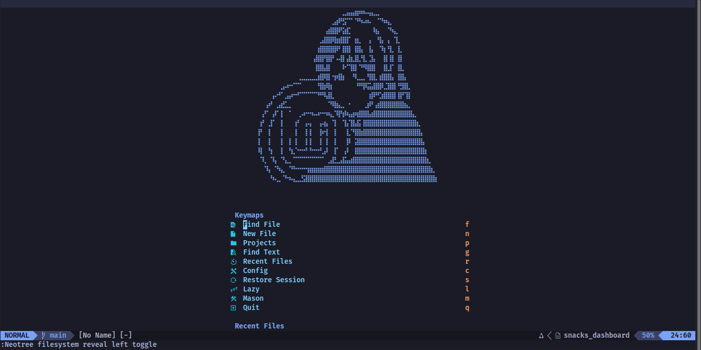
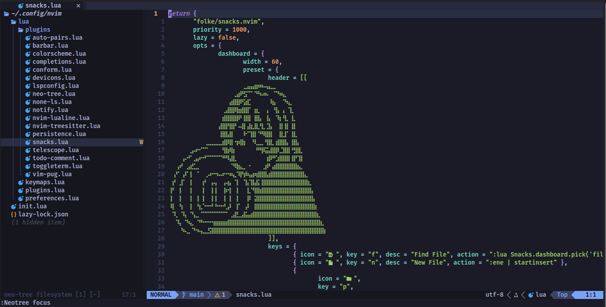

# 💤 My Neovim Config

Mi configuración personal de Neovim, armada desde cero con `lazy.nvim` como gestor de plugins.

## 📸 Screenshots

### Dashboard



### Editor / LSP en acción



## ✨ Features

- **LSP** completo vía `nvim-lspconfig` + `mason.nvim` (autocompletado, diagnósticos, inlay hints, go-to-definition)
- **Treesitter** (rama `main`, API moderna) para syntax highlighting
- **Formateo automático** al guardar con `conform.nvim` + Prettier/Stylua/rustfmt/clang-format
- **Autocompletado** con `nvim-cmp` + snippets estilo VS Code (`LuaSnip` + `friendly-snippets`)
- **Dashboard** de inicio con `snacks.nvim` (recent files, projects, restore session)
- **Explorador de archivos**: `neo-tree.nvim`
- **Fuzzy finder**: `telescope.nvim`
- **Buffers en pestañas**: `barbar.nvim`
- **Terminal integrada** con múltiples instancias: `toggleterm.nvim`
- **Restauración de sesiones**: `persistence.nvim`
- **Notificaciones**: `nvim-notify`
- **Íconos estilo Material**: `DaikyXendo/nvim-material-icon`
- **Soporte para Pug/Jade**: `vim-pug`
- **TODO highlighting**: `todo-comments.nvim`
- **Statusline**: `nvim-lualine`

### Lenguajes soportados (LSP + formateo)

| Lenguaje                        | LSP                     | Formatter      |
| ------------------------------- | ----------------------- | -------------- |
| Lua                             | `lua_ls`                | `stylua`       |
| TypeScript / JavaScript / React | `vtsls`                 | `prettier`     |
| Rust                            | `rust_analyzer`         | `rustfmt`      |
| C / C++                         | `clangd`                | `clang-format` |
| Java                            | `jdtls`                 | (LSP fallback) |
| Astro                           | `astro`                 | `prettier`     |
| Tailwind CSS (v3 y v4)          | `tailwindcss`           | —              |
| Markdown                        | `marksman`              | `prettier`     |
| HTML/CSS/JSX/TSX (Emmet)        | `emmet_language_server` | —              |

## 📋 Prerrequisitos

Antes de clonar esta config en una máquina nueva (probado en **Linux Mint / Ubuntu**), instala:

```bash
# Neovim (versión 0.11+ recomendado)
sudo apt update
sudo apt install neovim

# Git
sudo apt install git

# Compilador de C (necesario para compilar parsers de treesitter y algunos plugins nativos)
sudo apt install build-essential

# Node.js (necesario para varios LSPs instalados vía Mason)
sudo apt install nodejs npm

# ripgrep y fd (necesarios para Telescope: live_grep y find_files)
sudo apt install ripgrep fd-find

# unzip (para instalar Nerd Fonts manualmente)
sudo apt install unzip
```

### Nerd Font

Esta config usa iconos que requieren **cualquier [Nerd Font](https://www.nerdfonts.com/font-downloads)** instalada y seleccionada en tu terminal (Kitty, Alacritty, GNOME Terminal, etc.) — elige la que más te guste, cualquiera de las que ofrece el proyecto Nerd Fonts funciona (JetBrainsMono, Hack, CascadiaCode, etc.). Yo uso **FiraCode Nerd Font**.

Ejemplo de instalación (cambia `FiraCode` por la fuente que prefieras):

```bash
mkdir -p ~/.local/share/fonts/FiraCode
cd /tmp
wget https://github.com/ryanoasis/nerd-fonts/releases/latest/download/FiraCode.zip
unzip -o FiraCode.zip -d ~/.local/share/fonts/FiraCode
fc-cache -fv
```

Luego selecciona esa fuente **"... Nerd Font"** en la configuración de fuente de tu terminal.

## 🚀 Instalación

1. Haz backup de tu config actual si ya tienes una:

   ```bash
   mv ~/.config/nvim ~/.config/nvim.bak
   ```

2. Clona este repo:

   ```bash
   git clone https://github.com/noldee/nvim-config.git ~/.config/nvim
   ```

3. Abre Neovim:

   ```bash
   nvim
   ```

   La primera vez, `lazy.nvim` se bootstrapea solo y comienza a instalar todos los plugins automáticamente. Espera a que termine (puede tardar uno o dos minutos).

4. Cierra y vuelve a abrir Neovim, y corre:

   ```
   :Mason
   ```

   para confirmar que los LSPs/formatters se están instalando (Mason los instala automáticamente la primera vez, según lo declarado en `lspconfig.lua`).

5. Actualiza los parsers de treesitter manualmente por si acaso:

   ```
   :TSUpdate
   ```

6. Verifica que todo esté sano:
   ```
   :checkhealth
   ```

## ⌨️ Keymaps principales

> Leader key: `<Space>`

| Atajo                                      | Acción                                    |
| ------------------------------------------ | ----------------------------------------- |
| `<C-n>`                                    | Toggle explorador de archivos (Neo-tree)  |
| `<leader>e`                                | Focus explorador de archivos              |
| `<leader>ff`                               | Buscar archivos (Telescope)               |
| `<leader>fw`                               | Buscar texto (live grep)                  |
| `<leader>of`                               | Archivos recientes                        |
| `<leader>fc`                               | Cambiar colorscheme                       |
| `<tab>` / `<S-tab>`                        | Buffer siguiente / anterior               |
| `<leader>x`                                | Cerrar buffer                             |
| `<leader>/`                                | Comentar línea                            |
| `<C-a>`                                    | Seleccionar todo                          |
| `<leader>tr`                               | Toggle terminal (default)                 |
| `<leader>ts` / `<leader>tv` / `<leader>tf` | Terminal horizontal / vertical / flotante |
| `<leader>t1` `<leader>t2` `<leader>t3`     | Terminales numeradas independientes       |

## 🛠️ Troubleshooting

- **Un plugin no cargó / quedó a medias**: borra su carpeta y reinstala

  ```bash
  rm -rf ~/.local/share/nvim/lazy/<nombre-del-plugin>
  ```

  y luego `:Lazy sync` dentro de Neovim.

- **LSP no arranca en un proyecto**: revisa con

  ```
  :lua print(vim.inspect(vim.lsp.get_clients({bufnr = 0})))
  ```

  para confirmar si el cliente está conectado al buffer.

- **Cambios en config no se aplican**: corre `:Lazy sync` o reinicia Neovim completo.

- **Volver a un estado anterior si algo se rompe**:
  ```bash
  cd ~/.config/nvim
  git status
  git restore .          # descarta cambios no commiteados
  git reset --hard <hash>  # vuelve a un commit específico (revisa con git log --oneline)
  ```

## 📄 Licencia

Uso personal, siéntete libre de tomar ideas de aquí para tu propia config.
