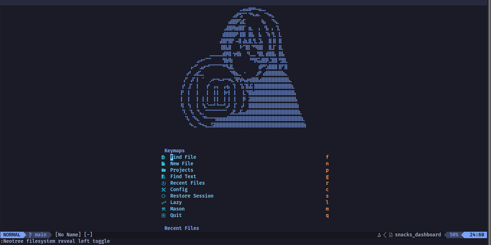
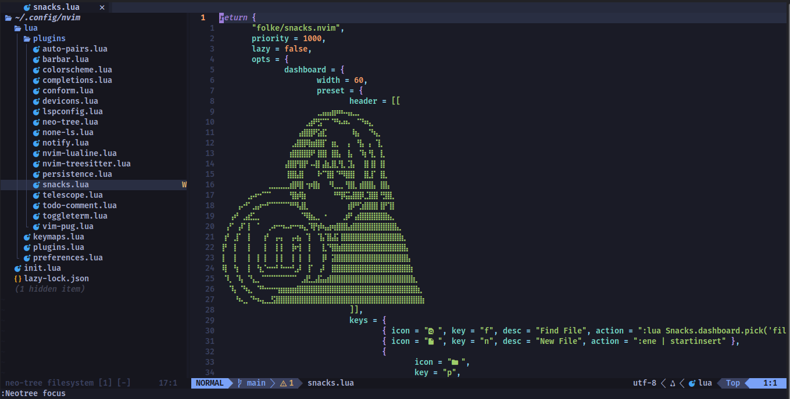

# 💤 My Neovim Config

My personal Neovim configuration, built from scratch with `lazy.nvim` as the plugin manager.

## 📸 Screenshots

### Dashboard


### Editor/LSP in action


## ✨ Features

- Complete **LSP** via `nvim-lspconfig` + `mason.nvim` (autocompletion, diagnostics, inlay hints, go-to-definition)
- **Treesitter** (`main` branch, modern API) for syntax highlighting
- **Auto format** on save with `conform.nvim` + Prettier/Stylua/rustfmt/clang-format
- **Autocompletion** with `nvim-cmp` + VS Code style snippets (`LuaSnip` + `friendly-snippets`)
- Startup **Dashboard** with `snacks.nvim` (recent files, projects, restore session)
- **File Explorer**: `neo-tree.nvim`
- **Fuzzy Finder**: `telescope.nvim`
- **Tab Buffers**: `barbar.nvim`
- **Integrated Terminal** with multiple instances: `toggleterm.nvim`
- **Session Restore**: `persistence.nvim`
- **Notifications**: `nvim-notify`
- **Material Style Icons**: `DaikyXendo/nvim-material-icon`
- **Pug/Jade Support**: `vim-pug`
- **TODO Highlighting**: `todo-comments.nvim`
- **Statusline**: `nvim-lualine`

### Supported Languages (LSP + Formatting)

| Language | LSP | Formatter |
| ------------------------------- | ----------------------- | -------------- |
| Lua | `lua_ls` | `stylua` |
| TypeScript/JavaScript/React | `vtsls` | `prettier` |
| Rust | `rust_analyzer` | `rustfmt` |
| C/C++ | `clangd` | `clang-format` |
| Java | `jdtls` | (LSP fallback) |
| Astro | `astro` | `prettier` |
| Tailwind CSS (v3 and v4) | `tailwindcss` | — |
| Markdown | `marksman` | `prettier` |
| HTML/CSS/JSX/TSX (Emmet) | `emmet_language_server` | — |

## 📋 Prerequisites

Tested on **Linux Mint / Ubuntu**. Install these before cloning:

```bash
# Neovim 0.11+
sudo apt update
sudo apt install neovim

# Git
sudo apt install git

# C compiler (for Treesitter parsers)
sudo apt install build-essential

# Node.js (for several LSPs installed via Mason)
sudo apt install nodejs npm

# ripgrep and fd (for Telescope)
sudo apt install ripgrep fd-find

# unzip (to install Nerd Fonts)
sudo apt install unzip
```

### Nerd Font

This config uses icons that require a Nerd Font selected in your terminal (Kitty, Alacritty, Windows Terminal, etc.). Any Nerd Font will work — I use **FiraCode Nerd Font**.

#### 🐧 Linux (Mint / Ubuntu)

```bash
mkdir -p ~/.local/share/fonts/FiraCode
cd /tmp
wget https://github.com/ryanoasis/nerd-fonts/releases/latest/download/FiraCode.zip
unzip -o FiraCode.zip -d ~/.local/share/fonts/FiraCode
fc-cache -fv
```

Then select `FiraCode Nerd Font` in your terminal's font settings.

#### 🪟 Windows

**Option 1 — Using PowerShell (recommended)**

Open PowerShell and run:

```powershell
# Create fonts folder
New-Item -ItemType Directory -Force -Path "$env:LOCALAPPDATA\Microsoft\Windows\Fonts"

# Download FiraCode Nerd Font
Invoke-WebRequest -Uri "https://github.com/ryanoasis/nerd-fonts/releases/latest/download/FiraCode.zip" -OutFile "$env:TEMP\FiraCode.zip"

# Extract
Expand-Archive -Path "$env:TEMP\FiraCode.zip" -DestinationPath "$env:TEMP\FiraCode" -Force

# Install fonts
Get-ChildItem "$env:TEMP\FiraCode\*.ttf" | ForEach-Object {
    Copy-Item $_.FullName "$env:LOCALAPPDATA\Microsoft\Windows\Fonts"
}

# Register fonts in the registry
$fonts = Get-ChildItem "$env:LOCALAPPDATA\Microsoft\Windows\Fonts\*.ttf"
$regPath = "HKCU:\SOFTWARE\Microsoft\Windows NT\CurrentVersion\Fonts"
foreach ($font in $fonts) {
    $name = $font.BaseName + " (TrueType)"
    New-ItemProperty -Path $regPath -Name $name -Value $font.FullName -PropertyType String -Force
}

# Cleanup
Remove-Item "$env:TEMP\FiraCode.zip"
Remove-Item "$env:TEMP\FiraCode" -Recurse -Force
```

**Option 2 — Manual**

1. Download the font from [Nerd Fonts releases](https://github.com/ryanoasis/nerd-fonts/releases/latest)
2. Extract the `.zip`
3. Select all `.ttf` files → Right-click → **Install for all users** (or **Install**)
4. Restart your terminal

Then select `FiraCode Nerd Font` in Windows Terminal:
- **Settings** → **Profiles** → **Appearance** → **Font face** → `FiraCode Nerd Font`

#### 🍎 macOS (bonus)

```bash
brew install --cask font-fira-code-nerd-font
```

Or manually:

```bash
mkdir -p ~/Library/Fonts
cd /tmp
curl -LO https://github.com/ryanoasis/nerd-fonts/releases/latest/download/FiraCode.zip
unzip -o FiraCode.zip -d ~/Library/Fonts
```

Then select `FiraCode Nerd Font` in your terminal's font settings.
On first launch, `lazy.nvim` will bootstrap itself and install all plugins automatically. Wait for it to finish (this may take a minute or two).

Mason will automatically install the LSPs and formatters on first run. You can verify with `:Mason`.

## ⌨️ Main Keymaps

> Leader key: `<Space>`

| Shortcut | Action |
| -------------------------------- | --------------------------------------- |
| `<C-n>` | Toggle file explorer (Neo-tree) |
| `<leader>e` | Focus file explorer |
| `<leader>ff` | Search files (Telescope) |
| `<leader>fw` | Search text (live grep) |
| `<leader>of` | Recent files |
| `<leader>fc` | Change colorscheme |
| `<leader>lp` | LSP document symbols |
| `<Tab>` | Next buffer |
| `<S-Tab>` | Previous buffer |
| `<leader>x` | Close buffer |
| `<leader>/` | Toggle comment |
| `<C-a>` | Select all |
| `<leader>tr` | Toggle terminal (default) |
| `<leader>ts` | Terminal horizontal |
| `<leader>tv` | Terminal vertical |
| `<leader>tf` | Terminal floating |
| `<leader>t1` | Terminal 1 |
| `<leader>t2` | Terminal 2 |
| `<leader>t3` | Terminal 3 |
